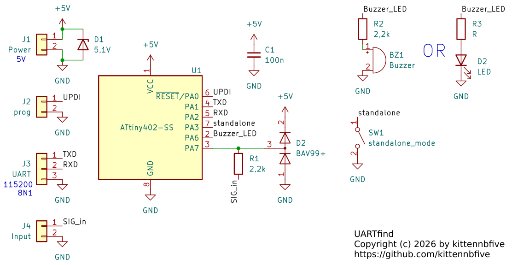
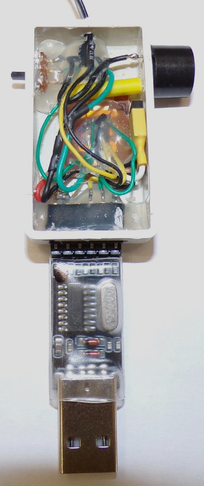
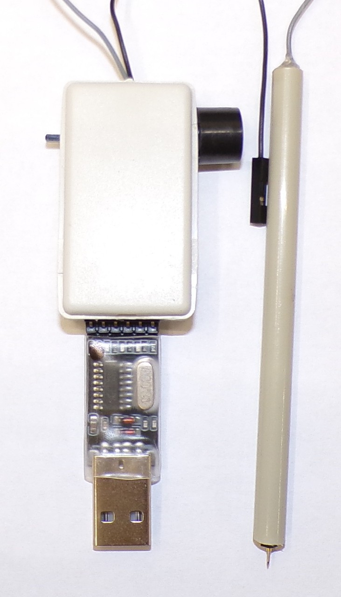

# UARTfind
A reverse-engineering helper for finding serial output while probing undocumented boards (hardware+software)

## Licence and Disclaimer
UARTfind is Copyright (c) 2026 by kittennbfive and released under AGPLv3+ WITHOUT ANY WARRANTY.

## The problem
When reverse-engineering boards e.g. for repair or writing your own firmware or ... one will almost always try to find a serial port that might give some informations about the target or even allow reflashing the main memory thanks to an integrated bootloader (think unbricking devices like routers after a failed firmware upgrade). If you are really lucky your target board will have a properly identified 3 or 4 pin header and you only have to check the voltage and find the correct baudrate. However for boards full of undocumented/unmarked testpoints the process is much more difficult, time consuming and error-prone. After finding a good ground you have to check every testpoint with an oscilloscope, possibly power-cycling the target in the process. Especially if the board is densely populated and/or the testpoints are really small you may have a hard time not moving your probe while looking at the scope screen to check for any activity. And if you are unlucky and slip with your probe you may even create a short and breathe some magic smoke.

## A (possible) solution
This is where this tool might be useful. It consists of some electronics (based around an Attiny402; an Attiny**2**02 should work too) that will continously check for serial signals and activate a buzzer (or a LED, your choice) if the signal you are probing is looking like a serial output. It also has a serial connection itself (5V at 115200 8N1) where it will output the baudrate and let you tweak some settings via a simple character based interface. Currently 14 standard baudrates from 600 Baud to 1MBaud are supported.  
By using this tool you can quickly probe testpoint after testpoint without having your eyes alternating between the board and the screen of your scope.

## Important safety notes
The hardware has some basic input protection that will clamp the input voltage to a safe level, so once you found a (possible) serial interface you **MUST** use your scope to check the voltage levels! Otherwise you might fry your USB to serial adapter or worse.  
Also this tool must **NOT** be used on anything that is referenced to mains voltage (think capacitive dropper power supply)! Always be careful!

## How does it work?
The basic idea is to continously measure the duration between two falling edges (remember, UART is idle high) and compare with a list of known durations (with about 3% tolerance) for standard baudrates. If enough samples are inside the allowed range for a given baudrate you might have found a serial output. The number of samples and the number of needed positive matches can be tweaked at runtime via the tool's own serial interface. Finding the right values turned out to be somewhat tricky. Feedback is welcome (open an issue)!

### Known baudrates
600; 1200; 2400; 4800; 9600; 19200; 38400; 57600; 115200; 230400; 460800; 576000; 921600; 1MBaud.  
Going lower is not possible because of internal timer overflow (and would be quite useless anyway). Going higher is not possible (feel free to prove me wrong!) because of the resolution of the internal timer, the Attiny can only run at 20MHz (which gives 50ns best case timer resolution).

## The hardware
There are not a lot of components as the Attiny402 is quite a capable chip. However beware that, unlike the "old" AVR, it is not programmable via SPI but (single wire) UPDI, so you need a suitable programmer (a slightly hacked USB to serial adapter will work fine using avrdude). The Attiny**2**02 should work too (untested), it is the same chip except for available memory.


U1 is the Attiny402 that does almost everything, with its mandatory 100nF decoupling MLCC C1. There are quite a few connectors, you may adapt the pinouts/... depending on your exact needs.
For signaling you can either install an active buzzer (that is with electronics inside; not the passive piezo disk that would need a square wave to work) or a LED or even both. It turns out these small buzzers i have in stock are awfuly loud, so i added a (quite high value) resistor in series. Also beware of maximum output current of the GPIO.  
SW1 changes the mode of operation of the device, see below. You can remove it or hardwire the pin to ground if you want.  
R1 and D2 provide some basic protection when probing unknown signals that might be outside the range 0V to 5V. D1 is also really important, it will clamp the supply voltage of the circuit to about 5,1V if there is current flowing trough R1 and D2. *To avoid messing up the edges of your signals you must choose a dual diode with low capacitance*, like the shown BAV99(+). Also R1 can't be too high. In doubt do some calculations (RC time constant and all this stuff) and/or check with a scope, but beware of the input capacitance of the latter. We are talking a few tens of picofarads here!  
The Attiny402 draws about 10mA so it can safely be powered by USB (from you USB to serial converter or a dedicated supply).

## The software
The software of the Attiny402 was written in assembly (yikes!) because of speed and because i really needed some exercise with that language...

### How to build
Run `avr-gcc -mmcu=attiny402 -o avr.elf main.S`. Adjust as needed if you want to use an Attiny**2**02 (untested). Flash with your favourite tool and UPDI-programmer. No fuses to set on this microcontroller.

### Modes of operation
In "standard" mode (pin 7 floating or pulled high) the device will emit a single beep once a (possibly) serial output was found. It will also print (via its own serial interface) the baudrate.  
In "standalone" mode (pin 7 grounded) the device will do the same *but* also emit a number of short beeps to give you the guessed baudrate index, from 600 Baud (1 beep) to 1MBaud (15 beeps). This mode makes it possible to use the device without a computer or serial interface connected, you just need to provide 5V DC. 

### "Signal flow" inside the Attiny
The signal, after some input protection, enters the Attiny on pin 3 that is PA7. From there it makes its way to the analog comparator to be compared with a configurable threshold (see below). The output of the comparator is redirected via the Event System to Timer B (TCB) that has a nice period measurement mode. Timer A (TCA) provides a timeout, set to 50ms. This is important because you don't want "old" samples in memory after you went to another testpoint of your target. Also the pins of the internal USART are "relocated" using the PORTMUX-feature. You don't have to worry about all that if you just want to use this tool without modifying it.

### Compile-time configuration
There are 3 `#define` at the beginning of the code for some important values you can change before compiling or at runtime via the serial interface (see below).
- `NB_SAMPLES_DEFAULT` is the number of samples (that is durations between two falling edges) taken by the code before checking against the values of known baudrates.
- `NB_MATCHES_MIN_DEFAULT` is the minimum number of positive matches while checking the taken samples. It must obviously be lower than the value above.
- `VOLTAGE_LEVEL_INDEX_DEFAULT` defines the voltage threshold used by the internal comparator of the Attiny:

|index|voltage level|
|-----|-------------|
|0|0.55V|
|1|1.1V (default)|
|2|2.5V|
|3|4.3V|
|4|1.5V|

(taken from the datasheet of the Attiny402 §18.5.1)

### Serial interface or runtime configuration
There is a basic (assembly is fun stuff...) serial interface that allows you to get or set some values using the serial interface on pins 4 and 5. It is 5V 115200 8N1.  
Every command begins either with a '?' to *get* something or a '!' to *set* something. It is then followed by a *single char* to tell *what* you want. If you are setting a value then the value (1 or 2 digits) follows immediatly. Each command is terminated by a '\n'.

#### Commands
- 'i' -> device <ins>i</ins>dentification (can't be set/changed)
- 's' -> number of <ins>s</ins>amples (min 1, max `NB_SAMPLES_MAX`)
- 'm' -> <ins>m</ins>inimum number of valid samples for a match / UART found (min 1, max current number of samples (see above))
- 'v' -> <ins>v</ins>oltage level index (from 0 to 4, see above)
- 'f' -> print last <ins>f</ins>ound baudrate in ASCII (can't be set/changed)

## Example output
On power on the device will output some basic header:
```
This is UARTfind v0.4
Copyright (c) 2026 by kittennbfive
AGPLv3+ and NO WARRANTY
https://github.com/kittennbfive
```
In case of a match it will output the guessed baudrate, the total number of samples and the number of positive samples/matches:
```
UART found: 115200 Baud (6/8 matches)
```
Please remember the warnings above before connecting anything except a scope to the testpoint you just probed!

## Example build
My own version was made using "dead bug" style mounting on a piece of scrap protoboard. It can directly plug into the USB to serial adapters i have laying around, the adapter will also provide power to the device. Everything was mounted/secured with a healthy amount of hotglue.  
The actual probe tip is a pogopin slit into an "Dupont"-housing for easier mounting/centering.


The internal connector on the right (with yellow heatshrink) allows reflashing the Attiny.

